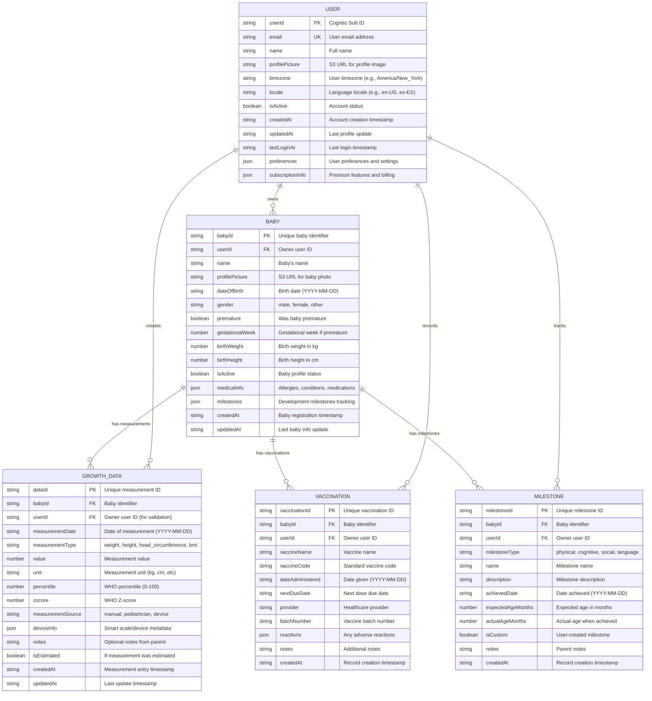

# 🗃️ UpNest Database Schema

## Entity Relationship Diagram



## Table Details

### 🧑‍🎯 Users Table
**Purpose**: Store user profiles and preferences
- **Table Name**: `UpNest-Users-${Environment}`
- **Partition Key**: `userId` (String) - Cognito Sub
- **Billing**: Pay-per-request
- **Estimated Cost**: ~$0.01/user/month

**Example Record:**
```json
{
  "userId": "auth0|cognito-sub-12345",
  "email": "parent@example.com",
  "name": "Maria Rodriguez",
  "profilePicture": "https://upnest-uploads.s3.amazonaws.com/profiles/user-12345.jpg",
  "timezone": "America/New_York",
  "locale": "en-US",
  "isActive": true,
  "createdAt": "2024-01-15T10:30:00Z",
  "updatedAt": "2024-01-15T10:30:00Z",
  "lastLoginAt": "2024-01-20T09:15:00Z",
  "preferences": {
    "units": "metric",
    "language": "en",
    "notifications": {
      "growthReminders": true,
      "milestoneAlerts": true,
      "vaccinationReminders": true
    },
    "theme": "light",
    "chartPreferences": {
      "showPercentiles": true,
      "defaultTimeRange": "6months"
    }
  },
  "subscriptionInfo": {
    "plan": "free",
    "expiresAt": null,
    "features": ["basic_tracking"]
  }
}
```

### 👶 Babies Table
**Purpose**: Store baby profiles linked to users
- **Table Name**: `UpNest-Babies-${Environment}`
- **Partition Key**: `babyId` (String) - UUID
- **Global Secondary Index**: `UserBabiesIndex` (userId)
- **Billing**: Pay-per-request
- **Estimated Cost**: ~$0.02/user/month

**Example Record:**
```json
{
  "babyId": "baby-uuid-abc123",
  "userId": "auth0|cognito-sub-12345",
  "name": "Emma Rodriguez",
  "profilePicture": "https://upnest-uploads.s3.amazonaws.com/babies/baby-abc123.jpg",
  "dateOfBirth": "2023-06-15",
  "gender": "female",
  "premature": false,
  "gestationalWeek": null,
  "birthWeight": 3.2,
  "birthHeight": 50.5,
  "isActive": true,
  "medicalInfo": {
    "allergies": [],
    "conditions": [],
    "medications": [],
    "pediatrician": {
      "name": "Dr. Smith",
      "phone": "+1-555-0123"
    }
  },
  "milestones": {
    "firstSmile": "2023-07-20",
    "firstWords": null,
    "firstSteps": null
  },
  "createdAt": "2024-01-15T10:30:00Z",
  "updatedAt": "2024-01-15T10:30:00Z"
}
```

### 📊 Growth Data Table
**Purpose**: Store time-series growth measurements
- **Table Name**: `UpNest-GrowthData-${Environment}`
- **Partition Key**: `dataId` (String) - UUID
- **Global Secondary Index 1**: `BabyGrowthIndex` (babyId + measurementDate)
- **Global Secondary Index 2**: `UserGrowthDataIndex` (userId + measurementDate)
- **Billing**: Pay-per-request
- **Estimated Cost**: ~$0.03/user/month

**Example Record:**
```json
{
  "dataId": "growth-uuid-def456",
  "babyId": "baby-uuid-abc123",
  "userId": "auth0|cognito-sub-12345",
  "measurementDate": "2024-01-15",
  "measurements": {
    "weight": 4500,
    "height": 75.2,
    "headCircumference": 46.8
  },
  "percentiles": {
    "weight": 75.2,
    "height": 68.5,
    "headCircumference": 72.1
  },
  "zscores": {
    "weight": 0.68,
    "height": 0.45,
    "headCircumference": 0.58
  },
  "measurementSource": "pediatrician",
  "deviceInfo": null,
  "notes": "Regular 6-month checkup - all measurements normal",
  "isEstimated": false,
  "createdAt": "2024-01-15T14:20:00Z",
  "updatedAt": "2024-01-15T14:20:00Z"
}
```

### 💉 Vaccinations Table
**Purpose**: Track vaccination records
- **Table Name**: `UpNest-Vaccinations-${Environment}`
- **Partition Key**: `vaccinationId` (String) - UUID
- **Global Secondary Index**: `BabyVaccinationsIndex` (babyId + dateAdministered)
- **Billing**: Pay-per-request
- **Estimated Cost**: ~$0.01/user/month

**Example Record:**
```json
{
  "vaccinationId": "vacc-uuid-ghi789",
  "babyId": "baby-uuid-abc123",
  "userId": "auth0|cognito-sub-12345",
  "vaccineName": "DTaP (Diphtheria, Tetanus, Pertussis)",
  "vaccineCode": "DTaP-1",
  "dateAdministered": "2023-08-15",
  "nextDueDate": "2023-10-15",
  "provider": "Pediatric Associates",
  "batchNumber": "ABC123DEF",
  "reactions": {
    "immediate": "None",
    "delayed": "Mild fussiness for 24 hours"
  },
  "notes": "First dose of DTaP series",
  "createdAt": "2023-08-15T16:30:00Z"
}
```

### 🎯 Milestones Table
**Purpose**: Track developmental milestones
- **Table Name**: `UpNest-Milestones-${Environment}`
- **Partition Key**: `milestoneId` (String) - UUID
- **Global Secondary Index**: `BabyMilestonesIndex` (babyId + achievedDate)
- **Billing**: Pay-per-request
- **Estimated Cost**: ~$0.01/user/month

**Example Record:**
```json
{
  "milestoneId": "mile-uuid-jkl012",
  "babyId": "baby-uuid-abc123",
  "userId": "auth0|cognito-sub-12345",
  "milestoneType": "physical",
  "name": "First Steps",
  "description": "Takes first independent steps",
  "achievedDate": "2024-02-10",
  "expectedAgeMonths": 12,
  "actualAgeMonths": 8,
  "isCustom": false,
  "notes": "Took 3 steps from couch to coffee table!",
  "createdAt": "2024-02-10T19:45:00Z"
}
```
{
  "babyId": "baby-uuid-abc123",
  "measurementDate": "2024-01-15",
  "userId": "auth0|cognito-sub-12345",
  "weight": 12.5,
  "height": 75.2,
  "headCircumference": 46.8,
  "percentileWeight": 75.2,
  "percentileHeight": 68.5,
  "percentileHeadCirc": 72.1,
  "notes": "Regular checkup - baby healthy and active",
  "createdAt": "2024-01-15T14:20:00Z"
}
```

## Query Patterns

### 🔍 Efficient Access Patterns

1. **Get User Profile**
   ```javascript
   const user = await dynamodb.get({
     TableName: 'UpNest-Users-prod',
     Key: { userId: cognitoSub }
   });
   ```

2. **Get User's Babies**
   ```javascript
   const babies = await dynamodb.query({
     TableName: 'UpNest-Babies-prod',
     IndexName: 'UserBabiesIndex',
     KeyConditionExpression: 'userId = :userId',
     ExpressionAttributeValues: { ':userId': currentUserId },
     FilterExpression: 'isActive = :active',
     ExpressionAttributeValues: { 
       ':userId': currentUserId,
       ':active': true 
     }
   });
   ```

3. **Get Baby's Growth History (All Types)**
   ```javascript
   const growthData = await dynamodb.query({
     TableName: 'UpNest-GrowthData-prod',  
     IndexName: 'BabyGrowthIndex',
     KeyConditionExpression: 'babyId = :babyId',
     ExpressionAttributeValues: { ':babyId': babyId },
     ScanIndexForward: false // Latest first
   });
   ```

4. **Get Baby's Growth History (All Measurements)**
   ```javascript
   const allMeasurements = await dynamodb.query({
     TableName: 'UpNest-GrowthData-prod',
     IndexName: 'BabyGrowthIndex', 
     KeyConditionExpression: 'babyId = :babyId',
     ExpressionAttributeValues: { 
       ':babyId': babyId
     },
     ScanIndexForward: false // Most recent first
   });
   ```

5. **Get Weight-Only Measurements (Filter at Application Level)**
   ```javascript
   const allMeasurements = await dynamodb.query({
     TableName: 'UpNest-GrowthData-prod',
     IndexName: 'BabyGrowthIndex', 
     KeyConditionExpression: 'babyId = :babyId',
     FilterExpression: 'attribute_exists(weight)',
     ExpressionAttributeValues: { 
       ':babyId': babyId
     },
     ScanIndexForward: false
   });
   ```

5. **Get Recent Measurements (Last 30 Days)**
   ```javascript
   const thirtyDaysAgo = new Date();
   thirtyDaysAgo.setDate(thirtyDaysAgo.getDate() - 30);
   
   const recentData = await dynamodb.query({
     TableName: 'UpNest-GrowthData-prod',
     IndexName: 'UserGrowthDataIndex',
     KeyConditionExpression: 'userId = :userId AND measurementDate >= :fromDate',
     ExpressionAttributeValues: { 
       ':userId': currentUserId,
       ':fromDate': thirtyDaysAgo.toISOString().split('T')[0]
     }
   });
   ```
   });
   ```

6. **Get Baby's Vaccination Schedule**
   ```javascript
   const vaccinations = await dynamodb.query({
     TableName: 'UpNest-Vaccinations-prod',
     IndexName: 'BabyVaccinationsIndex',
     KeyConditionExpression: 'babyId = :babyId',
     ExpressionAttributeValues: { ':babyId': babyId },
     ScanIndexForward: true // Chronological order
   });
   ```

7. **Get Baby's Milestone Progress**
   ```javascript
   const milestones = await dynamodb.query({
     TableName: 'UpNest-Milestones-prod',
     IndexName: 'BabyMilestonesIndex', 
     KeyConditionExpression: 'babyId = :babyId',
     FilterExpression: 'milestoneType = :type',
     ExpressionAttributeValues: { 
       ':babyId': babyId,
       ':type': 'physical' // or 'cognitive', 'social', 'language'
     }
   });
   ```

8. **Get Growth Data for Chart (Date Range)**
   ```javascript
   const chartData = await dynamodb.query({
     TableName: 'UpNest-GrowthData-prod',
     IndexName: 'BabyGrowthIndex',
     KeyConditionExpression: 'babyId = :babyId AND measurementDate BETWEEN :startDate AND :endDate',
     FilterExpression: 'measurementType IN (:weight, :height)',
     ExpressionAttributeValues: { 
       ':babyId': babyId,
       ':startDate': '2023-01-01',
       ':endDate': '2024-01-01',
       ':weight': 'weight',
       ':height': 'height'
     }
   });
   ```

## 🔒 Security Model

### Data Isolation Strategy
- **User Scoping**: All queries filter by `userId`
- **JWT Validation**: Lambda functions extract user from token
- **No Cross-User Access**: Impossible to access other user's data
- **Encryption**: All data encrypted at rest and in transit

### IAM Permissions
```json
{
  "Effect": "Allow",
  "Action": [
    "dynamodb:GetItem",
    "dynamodb:PutItem", 
    "dynamodb:UpdateItem",
    "dynamodb:DeleteItem",
    "dynamodb:Query"
  ],
  "Resource": "arn:aws:dynamodb:*:*:table/UpNest-*",
  "Condition": {
    "ForAllValues:StringEquals": {
      "dynamodb:Attributes": ["userId"]
    }
  }
}
```

## 💰 Cost Analysis

### Monthly Cost Estimation (100 Active Users)
| Resource | Volume | Unit Cost | Monthly Cost |
|----------|--------|-----------|--------------|
| **Users Table** | | |
| - Read Requests | 30K | $0.25/1M | $0.008 |
| - Write Requests | 1K | $1.25/1M | $0.001 |
| - Storage | 10MB | $0.25/GB | $0.003 |
| **Babies Table** | | |
| - Read Requests | 50K | $0.25/1M | $0.013 |
| - Write Requests | 2K | $1.25/1M | $0.003 |
| - Storage | 50MB | $0.25/GB | $0.013 |
| **Growth Data Table** | | |
| - Read Requests | 100K | $0.25/1M | $0.025 |
| - Write Requests | 10K | $1.25/1M | $0.013 |
| - Storage | 200MB | $0.25/GB | $0.050 |
| **Vaccinations Table** | | |
| - Read Requests | 5K | $0.25/1M | $0.001 |
| - Write Requests | 500 | $1.25/1M | $0.001 |
| - Storage | 20MB | $0.25/GB | $0.005 |
| **Milestones Table** | | |
| - Read Requests | 10K | $0.25/1M | $0.003 |
| - Write Requests | 1K | $1.25/1M | $0.001 |
| - Storage | 30MB | $0.25/GB | $0.008 |
| **TOTAL PER MONTH** | | | **$0.148** |
| **Cost per User** | | | **$0.0015** |

### Growth Projections
- **1,000 Users**: ~$1.48/month
- **10,000 Users**: ~$14.80/month  
- **100,000 Users**: ~$148/month
- **Highly scalable**: Pay only for what you use
- **Very affordable**: Less than $0.002 per user per month

### Additional AWS Costs (Not Included Above)
- **S3 Storage** (photos): ~$0.023/GB/month
- **CloudFront CDN**: ~$0.085/GB transferred
- **Lambda Functions**: ~$0.0000002 per request
- **API Gateway**: ~$3.50 per million requests

## 🚀 Implementation Priority

### Phase 1: Core Tables Setup ⏱️ 2 hours
- [ ] Deploy Users and Babies tables with CloudFormation
- [ ] Create basic Lambda CRUD functions
- [ ] Test user registration and baby creation flows
- [ ] Verify user data isolation

### Phase 2: Growth Data Integration ⏱️ 3 hours  
- [ ] Deploy Growth Data table with GSIs
- [ ] Update percentile Lambda to save to DynamoDB
- [ ] Connect frontend forms to DynamoDB APIs
- [ ] Test growth data entry and retrieval

### Phase 3: Extended Features ⏱️ 2 hours
- [ ] Deploy Vaccinations and Milestones tables
- [ ] Create additional Lambda functions
- [ ] Build vaccination scheduler
- [ ] Add milestone tracking UI

### Phase 4: Production Readiness ⏱️ 1 hour
- [ ] Add comprehensive error handling
- [ ] Implement data validation
- [ ] Set up monitoring and alerts
- [ ] Performance optimization

**Total Estimated Time**: 8 hours for complete backend implementation

## 🏗️ CloudFormation Templates

### Quick Deploy Commands
```bash
# Deploy all tables at once
aws cloudformation deploy \
  --template-file aws/infrastructure/dynamodb-tables.yaml \
  --stack-name upnest-dynamodb-dev \
  --parameter-overrides Environment=dev

# Deploy individual table
aws cloudformation deploy \
  --template-file aws/infrastructure/users-table.yaml \
  --stack-name upnest-users-dev \
  --parameter-overrides Environment=dev
```

## 📊 Monitoring and Maintenance

### Key Metrics to Track
- **Read/Write Capacity Utilization**: Keep under 80%
- **Throttled Requests**: Should be 0
- **Average Item Size**: Monitor growth over time
- **Query Performance**: P95 latency < 100ms
- **Error Rates**: < 0.1% for CRUD operations

### Backup Strategy
- **Point-in-Time Recovery**: Enabled on all tables
- **Daily Backups**: Automated with 30-day retention
- **Cross-Region Replication**: For disaster recovery (production only)

### Data Lifecycle Management
- **Growth Data**: Retain indefinitely (core feature)
- **User Activity Logs**: 90-day retention
- **Deleted Records**: Soft delete with 30-day recovery window
- **Inactive Users**: Archive after 365 days of inactivity

---

## 🚀 Deployed AWS Resources

### CloudFormation Stack Information
- **Stack Name**: `UpNest-DynamoDB-dev`
- **Region**: `eu-south-2`
- **Status**: `CREATE_COMPLETE`
- **Deployment Date**: `2025-06-28T15:15:11.454Z`

### DynamoDB Tables (Production Ready)

#### Users Table
- **Table Name**: `UpNest-Users-dev`
- **ARN**: `arn:aws:dynamodb:eu-south-2:568680248062:table/UpNest-Users-dev`
- **Primary Key**: `userId` (String)
- **Global Secondary Indexes**:
  - `EmailIndex`: `email` (HASH) - Status: ACTIVE
- **Features**: Point-in-Time Recovery ✅, SSE ✅, Streams ✅

#### Babies Table
- **Table Name**: `UpNest-Babies-dev`
- **ARN**: `arn:aws:dynamodb:eu-south-2:568680248062:table/UpNest-Babies-dev`
- **Primary Key**: `babyId` (String)
- **Global Secondary Indexes**:
  - `UserBabiesIndex`: `userId` (HASH), `dateOfBirth` (RANGE) - Status: ACTIVE
  - `ActiveBabiesIndex`: `userId` (HASH), `isActive` (RANGE) - Status: ACTIVE
- **Features**: Point-in-Time Recovery ✅, SSE ✅, Streams ✅

#### Growth Data Table
- **Table Name**: `UpNest-GrowthData-dev`
- **ARN**: `arn:aws:dynamodb:eu-south-2:568680248062:table/UpNest-GrowthData-dev`
- **Primary Key**: `dataId` (String)
- **Global Secondary Indexes**:
  - `BabyGrowthIndex`: `babyId` (HASH), `measurementDate` (RANGE) - Status: ACTIVE
  - `UserGrowthDataIndex`: `userId` (HASH), `measurementDate` (RANGE) - Status: ACTIVE
  - `BabyMeasurementTypeIndex`: `babyId` (HASH), `measurementType` (RANGE) - Status: ACTIVE
- **Features**: Point-in-Time Recovery ✅, SSE ✅, Streams ✅

#### Vaccinations Table
- **Table Name**: `UpNest-Vaccinations-dev`
- **ARN**: `arn:aws:dynamodb:eu-south-2:568680248062:table/UpNest-Vaccinations-dev`
- **Primary Key**: `vaccinationId` (String)
- **Global Secondary Indexes**:
  - `BabyVaccinationsIndex`: `babyId` (HASH), `dateAdministered` (RANGE) - Status: ACTIVE
  - `UserVaccinationsIndex`: `userId` (HASH), `dateAdministered` (RANGE) - Status: ACTIVE
  - `UpcomingVaccinationsIndex`: `babyId` (HASH), `nextDueDate` (RANGE) - Status: ACTIVE
- **Features**: Point-in-Time Recovery ✅, SSE ✅, Streams ✅

#### Milestones Table
- **Table Name**: `UpNest-Milestones-dev`
- **ARN**: `arn:aws:dynamodb:eu-south-2:568680248062:table/UpNest-Milestones-dev`
- **Primary Key**: `milestoneId` (String)
- **Global Secondary Indexes**:
  - `BabyMilestonesIndex`: `babyId` (HASH), `achievedDate` (RANGE) - Status: ACTIVE
  - `UserMilestonesIndex`: `userId` (HASH), `achievedDate` (RANGE) - Status: ACTIVE
  - `MilestoneTypeIndex`: `babyId` (HASH), `milestoneType` (RANGE) - Status: ACTIVE
- **Features**: Point-in-Time Recovery ✅, SSE ✅, Streams ✅

### CloudFormation Exports (For Lambda Integration)
```bash
# Table Names
UpNest-DynamoDB-dev-UsersTable
UpNest-DynamoDB-dev-BabiesTable
UpNest-DynamoDB-dev-GrowthDataTable
UpNest-DynamoDB-dev-VaccinationsTable
UpNest-DynamoDB-dev-MilestonesTable

# Table ARNs
UpNest-DynamoDB-dev-UsersTableArn
UpNest-DynamoDB-dev-BabiesTableArn
UpNest-DynamoDB-dev-GrowthDataTableArn
UpNest-DynamoDB-dev-VaccinationsTableArn
UpNest-DynamoDB-dev-MilestonesTableArn

# Environment & Stack
UpNest-DynamoDB-dev-Environment
UpNest-DynamoDB-dev-StackName
```

### CRUD Testing Status
✅ **Basic Operations**: All tables tested with CREATE, READ, UPDATE, DELETE
✅ **User Data Isolation**: Verified users can only access their own data
✅ **GSI Queries**: All Global Secondary Indexes operational and tested
✅ **CloudFormation Outputs**: All exports available for Lambda integration

### Next Steps for Lambda Integration
1. Reference CloudFormation exports in Lambda template
2. Add DynamoDB permissions to Lambda execution roles
3. Use table names from exports (not hardcoded values)
4. Implement error handling for DynamoDB operations
